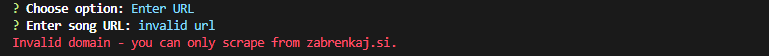

# Zabrenkaj.si Scraper
Easy to use CLI application for scraping song tabs from [zabrenkaj.si](https://zabrenkaj.si/).


## Set up
*It is expected you already have [NodeJS](https://nodejs.org/en/) installed*<br/>
You can either run the install dependencies command yourself or run the "*start.bat*" script.
```
npm install
```

## Usage
Again you can use the "*start.bat*" script to run the program.
```cmd
npm start
```

## Output
The program will output the **.tab** files into the **downloads** folder.

## Screenshots
> Screenshots of successful and unsuccessful requests.

